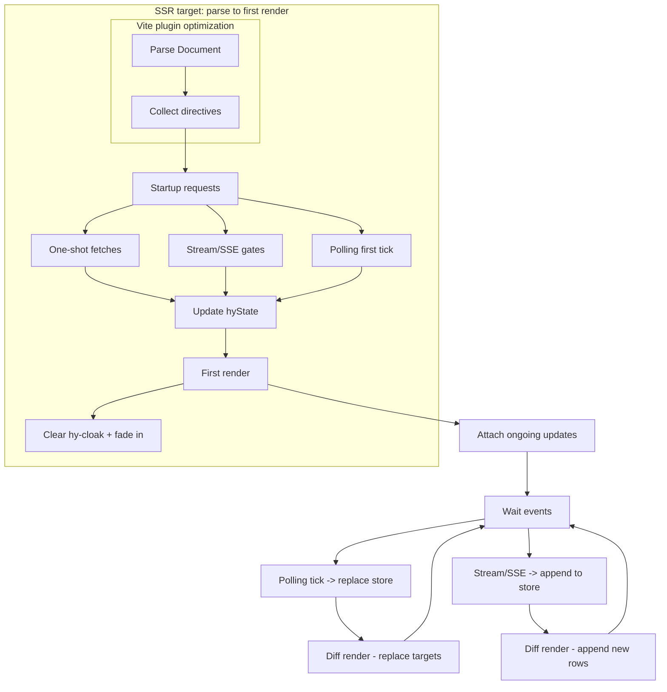

# HyTDE Architecture (Draft)

This document is a high-level architecture overview of HyTDE: data storage, execution flow, imports, initial request scheduling, forms, and JavaScript extension points.

It is intentionally implementation-agnostic (browser runtime, build/pre-render, and non-JS server render should behave equivalently).

Related specs:
- Template language: `design/template-language.md`
- Data store: `design/data-store.md`
- Fetching & mocking: `design/fetching.md`
- Imports: `design/template-import.md`
- Routing: `design/routing.md` (+ optional route fallback server proposal)
- Navigation: `design/detail/routing.md`
- Forms: `design/forms.md`
- Tables (extable): `design/table.md`
- Dynamic behaviors (validators, JSON submit): `design/dynamic-behavior.md`
- Vite future modes: `design/vite-modes.md`

## 1. Core idea

HyTDE treats a valid `.html` file as the source of truth and progressively enhances it using declarative `hy-*` directives:
- fetch JSON, store it in a named namespace (`hy-store`)
- bind values into the DOM (`hy`, `hy-attr-*`)
- apply structural directives (`hy-if`, `hy-for`, `hy-dummy`)
- optionally mount dynamic “islands” (tables, combobox, validators) after initial DOM exists

The key rule is explicitness:
- requests do not introduce implicit variables
- data is read from a global store and referenced by explicit paths (plus loop vars and reserved globals)

## 2. Data model: global store + namespaces

### 2.1 Global store

HyTDE maintains a global data store:
- `hyState`: an object containing named namespaces (e.g. `hyState.current`)

### 2.2 Writing data (`hy-store`, `hy-unwrap`)

Request directives (`hy-get`, `hy-post`, ...) become meaningful when paired with storage:
- `hy-store="<namespace>"` writes the parsed response to `hyState.<namespace>`
- the namespace is also exposed as a selector alias (e.g. `current` → `hyState.current`)
- `hy-unwrap="<key>"` may unwrap a top-level field before storing (e.g. unwrap `data`)
- store updates are replacement (the namespace value is replaced entirely)

### 2.3 Reading data (selectors)

Selectors resolve names in this order:
1. nearest-to-farthest `hy-for` loop variables
2. store namespaces (aliases, e.g. `current`)
3. reserved globals (`hyParams`, `hyAuth`, ...)

See `design/template-language.md`.

### 2.4 Updates and reactivity

Store writes are the main trigger for updates:
- when `hyState.<namespace>` is updated, HyTDE re-evaluates directives/bindings that depend on that data
- dynamic components that read from store paths (e.g. tables via `hy-data`) are notified and updated (conceptually `setData`)

Implementation note (open): see section 8 for DOM update strategies.

## 3. Execution modes (`hy-mode`) vs delivery strategies

HyTDE separates:
- execution mode: `<meta name="hy-mode" content="production|mock|disable">` (`design/modes.md`)
- delivery/rendering strategy: CDN runtime, Vite static-optimized, Vite SPA, SSR (`design/modes.md`, `design/vite-modes.md`)

`hy-mode="production"` can exist in all production strategies (CDN runtime, optimized HTML, SPA, SSR).

## 4. Import pipeline (`hy-import` / `hy-export`)

HyTDE supports trusted HTML reuse via in-place replacement:
- `<hy-import src="...">` is replaced by the imported content’s exported node (`hy-export`)
- exported assets (`<script>`, `<style>`, `<link>` with `hy-export`) are merged into the importer document head
- imports are resolved depth-first before processing other directives (recommended), so the final DOM is import-expanded

See `design/template-import.md`.

## 5. Initial request scheduling (startup)

HyTDE can minimize waterfalls by collecting requests and running them concurrently.

Recommended startup order:
1. Determine `hy-mode` (`disable` stops here).
2. Resolve `hy-import` (depth-first).
3. Extract globals (`hyParams`, `hyAuth`, etc.).
4. Discover request directives in the resulting DOM:
   - `hy-get` on any element
   - forms with `hy-get`/`hy-post`/...
5. Build a request plan and execute:
   - `GET` requests are deduped by resolved URL within the current render scope (`design/fetching.md`)
   - `mock` mode may intercept requests and serve fixtures (`design/fetching.md`)
6. For each resolved response:
   - apply `hy-unwrap`, store into `hyState.<namespace>` via `hy-store`
   - schedule DOM updates for consumers

Shared request state:
- requests update `hy.loading` / `hy.errors` (reserved runtime globals; see `design/fetching.md`)

Notes:
- v1 can treat “startup `hy-get` elements” as “fire on initial load”.
- forms only send requests on submit/auto-submit; they are not part of the “initial request plan” unless explicitly triggered (e.g. `hy-history="sync-..."` auto-submit behavior).

## 5.1 Runtime workflow (requests, gating, render)

High-level workflow (browser runtime):
1. Parse document and collect directives (including stream/SSE/polling tags).
2. Run startup requests:
   - `hy-get` / `hy-post` / ... (one-shot)
   - `hy-get-stream` (gated by `stream-initial` / `stream-timeout`)
   - `hy-sse` (gated by `stream-initial` / `stream-timeout`)
   - `hy-get-polling` (first tick)
3. When all startup requests and gates are satisfied, perform the first render:
   - `hy-cloak` is cleared and faded in after first render.
4. Subsequent updates:
   - `hy-get-polling` replaces store on each tick (if valid JSON).
   - `hy-get-stream` / `hy-sse` append items and render only newly appended rows.

Notes:
- Stream/SSE are treated as “gated startup” for first render; they are not awaited for completion.
- Initial render happens after:
  - all one-shot startup requests complete
  - polling has completed its first tick
  - stream/SSE gates pass (count or timeout)

### Mermaid (runtime flow)

## 6. Forms and navigation

Baseline:
- plain HTML `<form method action>` navigates as usual

HyTDE enhancement:
- if a form has `hy-get`/`hy-post`/`hy-put`/`hy-patch`/`hy-delete`, HyTDE intercepts submit and performs a fetch-only request (no navigation by default)
- responses should be stored via `hy-store` and then drive rerenders
- `hy-history` supports URL↔form sync patterns for search screens

Optional proposal:
- `hy-redirect` to navigate after a fetch-only submit (`design/detail/routing.md`)

See `design/detail/forms.md` and `design/detail/routing.md`.

## 7. JavaScript extension points (progressive enhancement)

HyTDE allows optional post-render JS to enhance UX while keeping initial HTML server/static-friendly.

### 7.1 Validators

- Register validators in JS: `hy.validator(id, fn)`
- Bind in markup: `<input hy-validator="id">`
- Use native constraint validation as the baseline; custom validators set/clear validity via `setCustomValidity`

See `design/dynamic-behavior.md`.

### 7.2 Tables (extable)

Tables are enhanced when the runtime executes:
- `<table hy-table-data="departments" hy-data="current.departments" hy-edit-mode="direct">`
- Direct edit mode emits edit events for JS sync:
  - `hy.on("table-edit", tableKey?, handler)` for delta payloads
  - optional proposal: `hy.on("table-edit-all", ...)` for full dataset payloads

See `design/table.md` and `samples/table-direct-edit/index.html`.

### 7.3 Other dynamic widgets (future)

Combobox/typeahead and other widgets can follow the same pattern:
- declarative markup for baseline static/SSR
- optional runtime enhancement with a small JS module and event hooks

See `design/combobox.md`.

## 8. DOM update strategy (open design)

HyTDE updates are expected to be relatively infrequent in typical business flows:
- initial load
- user submits a form (or debounced search)
- occasional direct edits (table/combobox)

This allows simpler update strategies than a full virtual DOM or Incremental DOM.

Candidate strategies (ordered from simplest to more optimized):

### 8.1 “Re-run directives” with minimal bookkeeping (simple)

On each `hyState.<namespace>` update:
- re-evaluate all structural directives (`hy-if`, `hy-for`, `hy-dummy`) and bindings (`hy`, `hy-attr-*`) in the document (or in a scoped subtree)
- dynamic islands update themselves from store paths

Pros:
- small code size
- easy to reason about correctness

Cons:
- can do redundant work for large documents

### 8.2 Namespace-level dirty tracking (recommended middle ground)

Track which store namespaces changed (e.g. `current`) and only re-evaluate nodes that *mention* that namespace in their selectors/attributes.

Implementation sketch:
- during initial parse, collect dependencies:
  - for each directive/binding node, extract referenced root identifiers (`current`, `hyParams`, loop vars ignored)
  - store reverse index: `namespace -> [nodes]`
- when `hyState.current` changes, re-evaluate only nodes indexed under `current`

Pros:
- still small-ish
- avoids scanning everything on every update

Cons:
- dependency extraction must match the selector/interpolation grammar

### 8.3 Path-level dependency graph (more precise)

Track dependencies at a path granularity (e.g. `current.users`).

Pros:
- fewer unnecessary updates

Cons:
- more code and complexity (path normalization, aliasing, arrays)
- likely unnecessary for v1 given the expected update frequency

Open question:
- which level (8.1 vs 8.2) best fits HyTDE’s goals of “small runtime” and “predictable behavior”?
